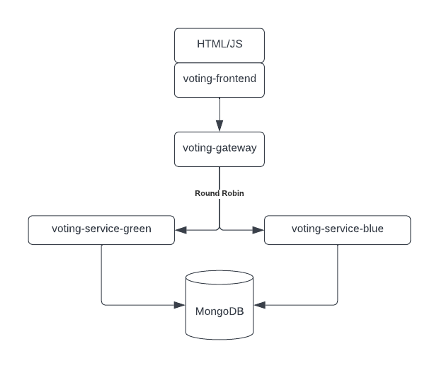

# Sentry OpenTelemetry/Node Sample Application

This repository contains a set of Node.js/Express services that provide a simple multi-tier application that lets you vote for using spaces versus tabs in code.

* `voting-frontend` renders the website using data fetched from `voting-service-gateway`.
* `voting-service-gateway` randomly toggles between `voting-service-green` and `voting-service-green` and passes the request through to the respective service.
* `voting-service-green` provides the access layer to MongoDB where the data is stored.
* `voting-service-blue` represents a faulty version and returns an error.

## Installation
* This sample expects MongoDB to be running on `localhost:27017` - please install the community edition [following the instructions for your platform](https://www.mongodb.com/docs/manual/administration/install-community/).
* After downloading/cloning this repository open your console, change into the root of the repository and run `install.sh` to install all dependencies. This can take a while.
* While still in the root directory, run `npx pm2 startOrRestart ecosystem.config.js`. Answer "yes" if you are prompted if `pm2` should be downloaded.
* (To stop all services, run `npx pm2 stop ecosystem.config.js`.)

## Setting up Sentry

1. Copy [.env-sample](./.env-sample) and rename it to `.env`.
2. In Sentry, create the following projects and edit `.env` to set the respective DSN:
* `browser` (JS)
* `frontend` (Express)
* `gateway` (Express)
* `service-green` (Express)
* `service-blue` (Express)
3. Restart all services by running `npx pm2 startOrRestart ecosystem.config.js`.

## Using the Sample Application
The frontend at [localhost:8080](http://localhost:8080).
Use the buttons to cast your vote. Every time a ☠️ is shown instead of the tally, you hit the faulty `service-blue`.

## Troubleshooting
If you can't access the frontend, or voting doesn't work, run `pm2 status` and look for a service with status `error`.
Do get the logs for a service, run `pm2 logs servicename`.

## Known Issues
* Currently some transactions may show up as `<< unparameterized >>`.